# Évaluation Architectures Micro-services
## Problème :

On souhaite développer un POC (Proof Of Concept)sous forme d’une application web basée sur une architecture
micro-service an utilisant l’écosystème Spring Boot et Spring Cloud coté backend et un Framework comme
Angular ou React coté Frontend.

L’application doit permettre de gérer des porte feuilles (Wallets) de devises ainsi que les transferts entre les
portes feuilles. Pour faire plus simple, cette application se composera de deux micro-services fonctionnels :

• Un Micro-service qui permet de gérer des « Wallet ». Chaque Wallet appartient à un client. Un client est
défini par son id (numérique auto incrémenté), son nom et son email. Une Wallet est définie par son id
(String de type UUID), son solde, sa date de création, sa devise.

• Un Micro-service qui permet de gérer des transferts entre les Wallets. Chaque transfert est défini par
son id, sa date, Wallet source, Wallet destination, son montant, son état (PENDIND, VALIDATED,
REJECTED)

Les micro-services technique à mettre en place sont :

• Le service Gateway basé sur Spring cloud Gateway

• Le service Discovery base sur Eureka Server ou Consul Discovery (au choix)

• Le service de configuration basé sur Spring cloud config ou Consul Config (au choix)

Pour les micro-services, il faut générer la documentation des web services Restfull en utilisant la spécification
OpenAPIDoc (Swagger)

## Implementation:

### Creation des services : 
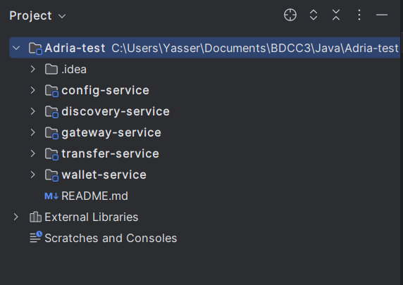

## Gateway:

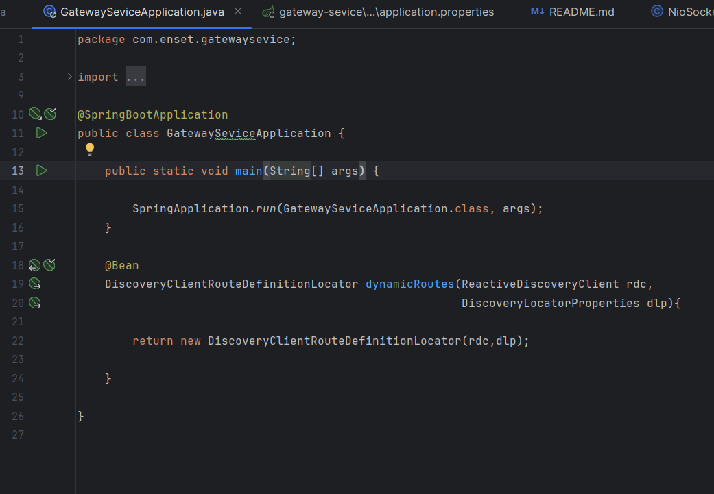

### Discovery:
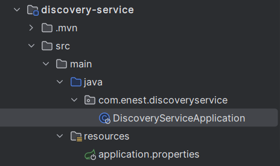
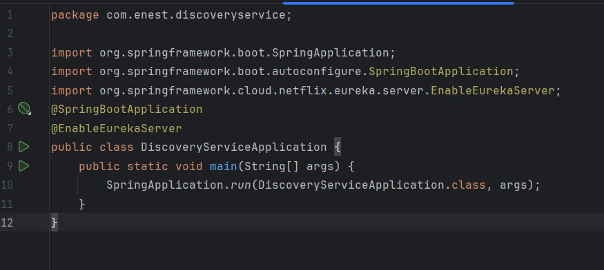
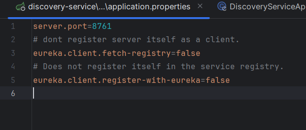

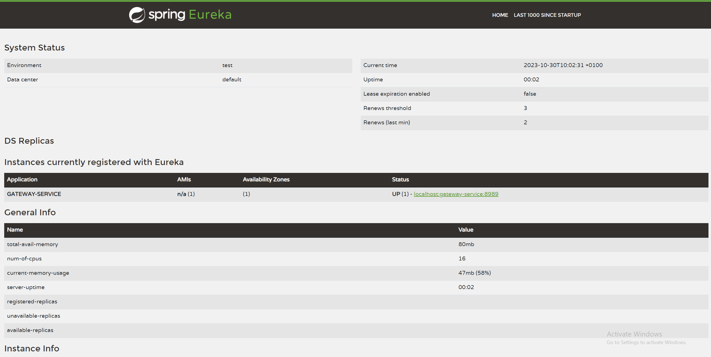

### client :
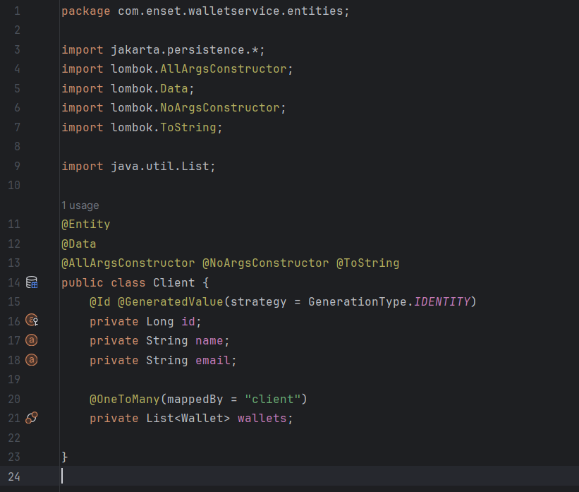

### wallet :
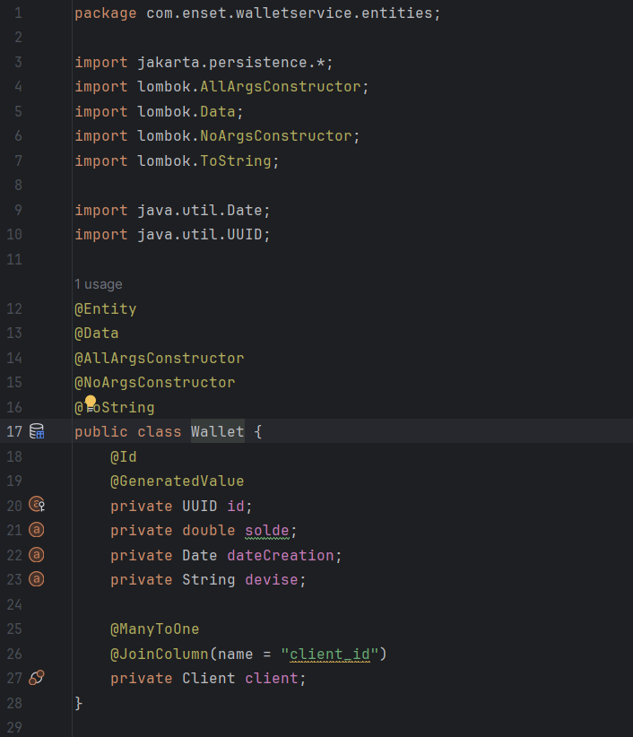

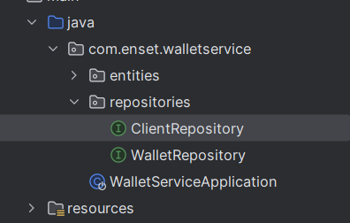

### test : 

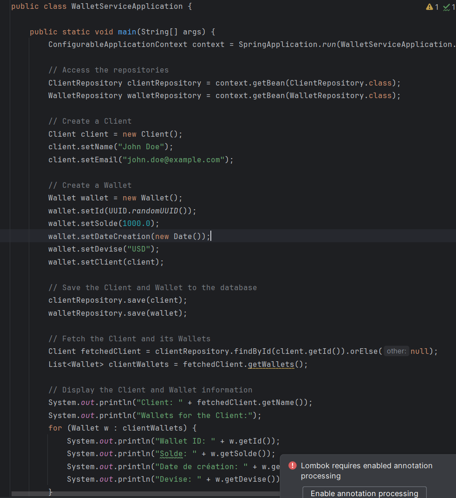

Check H2 databases
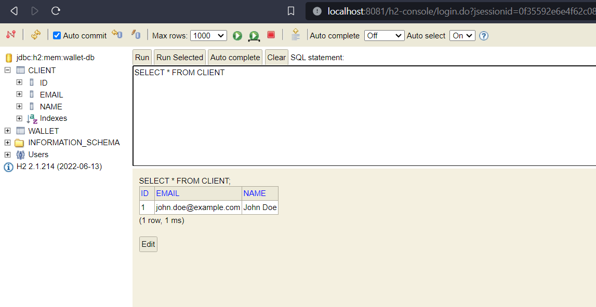
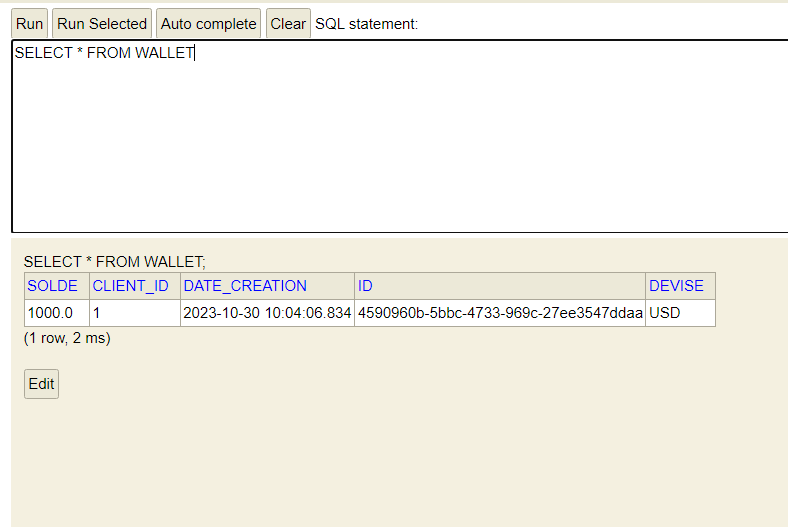

Get wallets from discovery
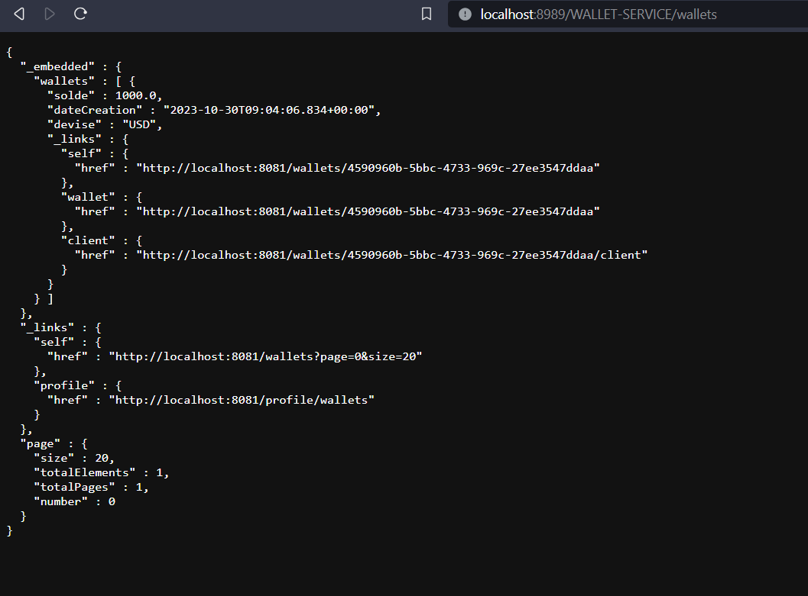

### Transfer Service

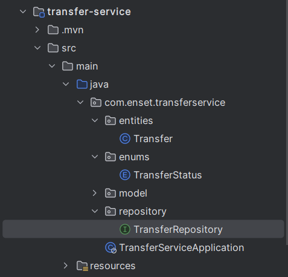

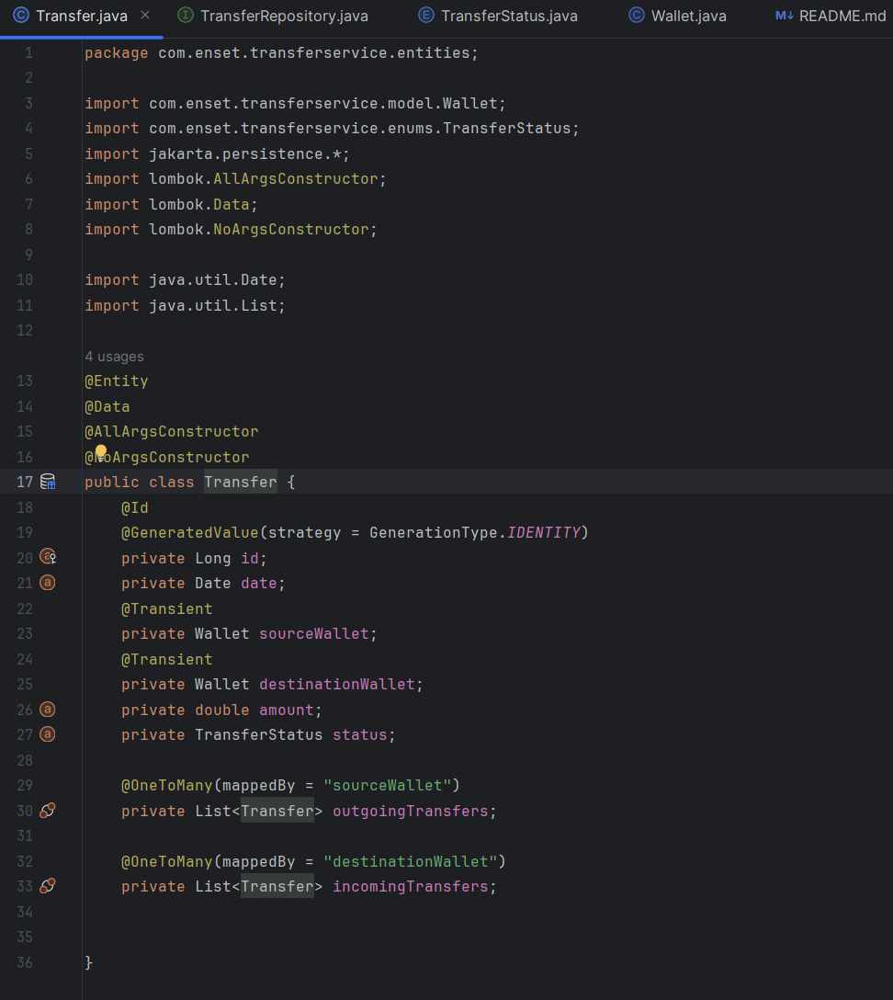

